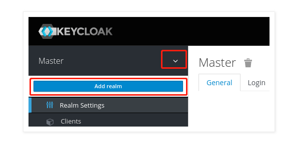
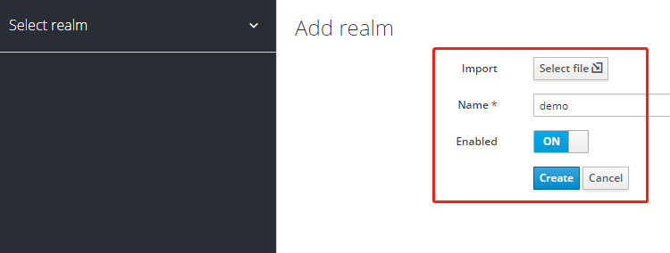
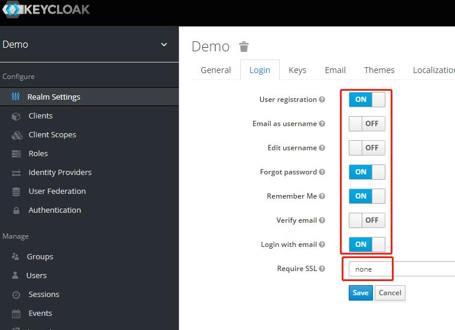
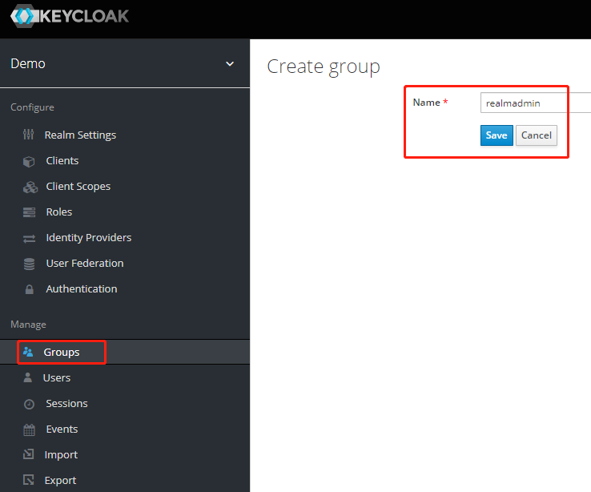
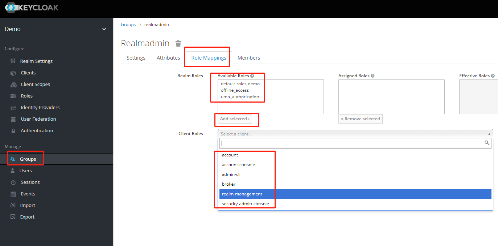
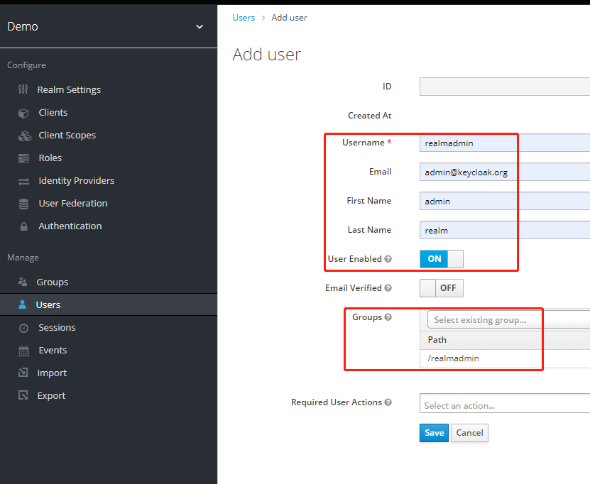
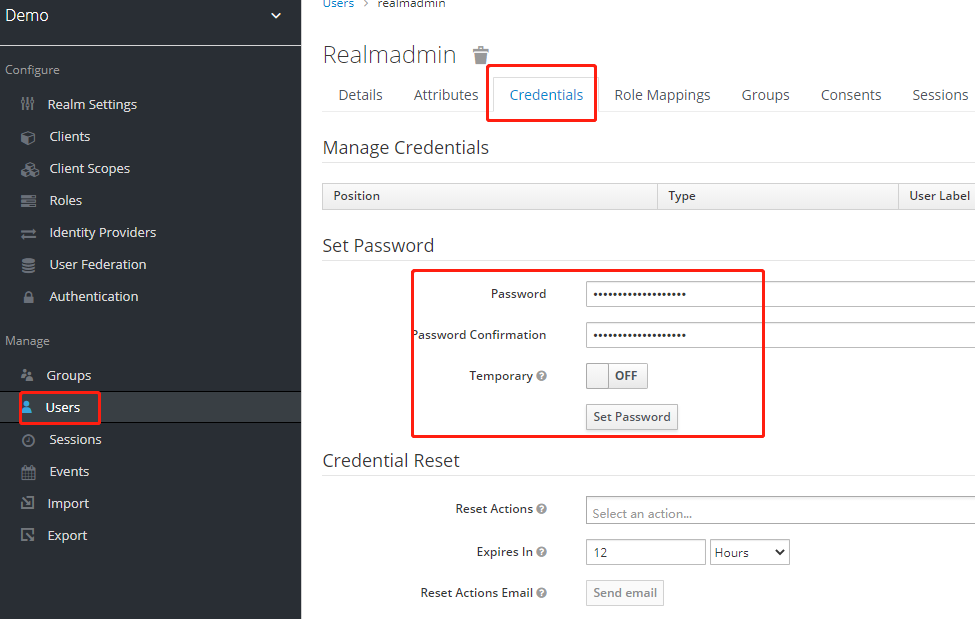
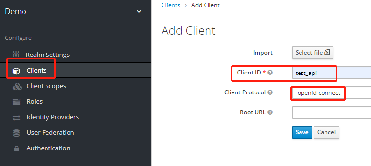
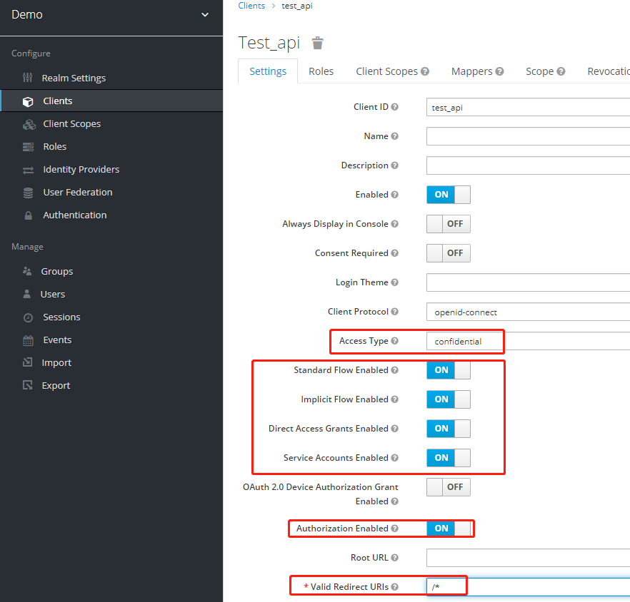

# pyKeyCloakRBAC demo文档

## 概述
项目在ubuntu服务器，使用docker部署，主要依赖于keycloak，使用mysql做持久化存储，flask进行web服务展示。

1. mysql服务部署
2. keycloak服务部署及简单配置,使用可参考 https://www.keycloak.org/documentation
3. flask demo 服务配置及运行


## 服务部署
>参考 https://hub.docker.com/r/jboss/keycloak

>参考 https://www.keycloak.org/getting-started/getting-started-docker

### mysql 5.7 部署
    
```
指定keycloak服务使用的数据库端口，名称，用户名以及密码，宿主机持久化目录。
执行命令：
>>> docker run --name mysql -d -p5007:3306 -e MYSQL_DATABASE=keycloak -e MYSQL_USER=keycloak -e MYSQL_PASSWORD=password -e MYSQL_ROOT_PASSWORD=root_password -v <宿主机目录>:/var/lib/mysql mysql:5.7
```

### keycloak 部署

```
配置keycloak所需的数据库信息，端口, 管理员账户及密码等。
部署keycloak使用如下命令：
>>> docker run --name keycloak -d -p8080:8080 -e DB_VENDOR=mysql -e DB_DATABASE=keycloak -e DB_ADDR=192.168.0.240 -e DB_PORT=5007 -e DB_USER=keycloak -e DB_PASSWORD=password -e KEYCLOAK_USER=admin -e KEYCLOAK_PASSWORD=admin_password quay.io/keycloak/keycloak:13.0.1

等待服务部署完成后，执行如下操作：
>>> 修改数据表,连接数据库后，选择keycloak数据库，执行如下操作：
>>> update REALM set SSL_REQUIRED='NONE';

修改完成后，重启keycloak服务即可。
访问keycloak的服务，通过设定的用户名和密码可以登录keycloak管理界面。
```

### [keycloak 基本使用](https://www.keycloak.org/getting-started/getting-started-docker)

1. 创建realm，name为demo，如下图



2. 创建realm demo的管理员权限组

添加所有角色给group

3. 创建管理员用户，并设置密码


4. 创建要保护的client test_api


5. 使用admindemo.py
    
    * 配置实际的keycloak的地址，用户名，密码等。


